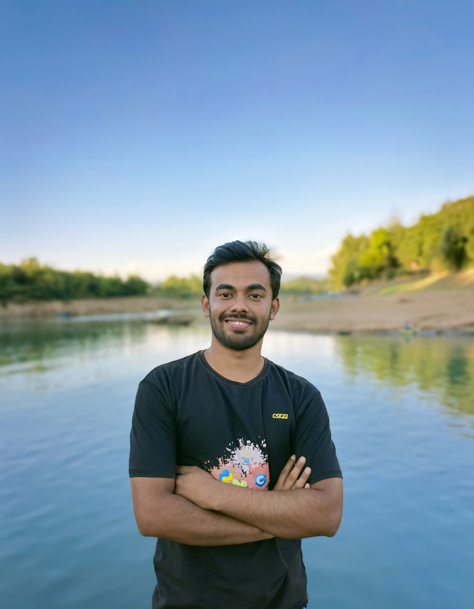

<div align="center">

  <!-- Round profile avatar — top-right corner of banner -->
  <p align="right">
    
  </p>

  <!-- Banner header -->
  

  <br/>

  <!-- Typing headline — mirrors portfolio.js `roles` order -->
  

  <br/><br/>

  <!-- Contact pills -->
  <a href="https://rahad-islam.vercel.app" target="_blank">
    
  </a>
  <a href="mailto:vairahad99@gmail.com" target="_blank">
    
  </a>
  <a href="https://github.com/Rahad0Islam" target="_blank">
    
  </a>
  <a href="https://www.linkedin.com/in/md-rahad-islam/" target="_blank">
    
  </a>
  <a href="https://codeforces.com/profile/Rahadvai" target="_blank">
    
  </a>
  <a href="https://leetcode.com/u/rahad_vai/" target="_blank">
    
  </a>
  <a href="tel:+8801826443893" target="_blank">
    
  </a>

</div>

<br/>

<!-- Profile + About row -->
<div align="center">

### 👋 Hi, I'm Rahad Islam

</div>

I'm a **Computer Science & Engineering** undergraduate at **Shahjalal University of Science and Technology (SUST)** with a CGPA of **3.81 / 4.00**.

I build modern **full-stack web platforms** with React, Next.js, Tailwind CSS, Node.js, Spring Boot, PostgreSQL, and MongoDB — and ship them through **Docker, Kubernetes, and GitHub Actions** pipelines. As a competitive programmer I've solved **1,500+ problems** across Codeforces, LeetCode, AtCoder, and CodeChef, ranking **Pupil @ Codeforces** and **2★ @ CodeChef**.

I'm a **Top 20 finalist at BUET CSE Fest 2026** (DevOps & Microservices track) and an **onsite builder at DNA Hack for Health 2026**, where my team shipped **MaCare**, a maternal & child health platform now used in field pilots across rural Bangladesh.

Currently exploring **AI/ML** and integrating intelligent features into scalable full-stack applications.

<br/>

<!-- About card + Quick info -->
<table align="center">
  <tr>
    <td width="55%" valign="top">

### 👨‍💻 About Me

```yaml
name      : Rahad Islam
role      : Aspiring Software Engineer | Full-Stack Developer
location  : Sylhet, Bangladesh
cgpa      : 3.81 / 4.00 (SUST — CSE)
problems  : 1,500+ (CF · LC · AtCoder · CC)
email     : vairahad99@gmail.com
portfolio : https://rahad-islam.vercel.app

focus:
  - Full-Stack Web Engineering     (MERN · Next.js · Spring Boot)
  - DevOps & Microservices          (Docker · K8s · GitHub Actions)
  - AI / ML Integration             (HuggingFace · OpenAI API)
  - Competitive Programming         (graphs · DP · math)
```

  </td>
  <td width="45%" valign="top">

### 🔭 Current Focus

- 🤖 Building intelligent features with **HuggingFace** & **OpenAI**
- 🏗️ Designing **microservices** with Kubernetes and Circuit Breakers
- 🩺 Scaling **MaCare** for rural maternal-health programs
- 📚 Deepening **system design** for new-grad interviews

### 🌱 Open To

- ✅ Full-time **Software Engineer** roles (new-grad 2027)
- ✅ Summer **internships** (frontend / backend / full-stack)
- ✅ **Freelance** web & DevOps projects
- ✅ **Open-source** collaborations

  </td>
  </tr>
</table>

<br/>

---

## 🏆 Achievements

<table align="center">
  <thead>
    <tr>
      <th align="left">🏅 Achievement</th>
      <th align="left">Event / Detail</th>
      <th align="left">Track / Outcome</th>
      <th align="center">Year</th>
    </tr>
  </thead>
  <tbody>
    <tr>
      <td>🏅 <b>BUET CSE Fest — Top 20 Finalist</b></td>
      <td>BUET CSE Fest 2026 · Team <b>SUST_DeployX</b></td>
      <td>Microservices &amp; DevOps · Built <b>Valerix</b></td>
      <td align="center"><code>2026</code></td>
    </tr>
    <tr>
      <td>🩺 <b>DNA Hack for Health — Onsite Finalist</b></td>
      <td>DNA Hack for Health 2026 · MAG Osmani Medical College, Sylhet · Team <b>LifeLink</b></td>
      <td>Maternal &amp; Child Health · Built <b>MaCare</b></td>
      <td align="center"><code>2026</code></td>
    </tr>
    <tr>
      <td>🏆 <b>1,500+ Problems Solved</b></td>
      <td>Codeforces (Pupil) · CodeChef (2★) · LeetCode · AtCoder</td>
      <td>Math · Graphs · DP · Data Structures</td>
      <td align="center"><code>—</code></td>
    </tr>
    <tr>
      <td>⭐ <b>CGPA 3.81 / 4.00</b></td>
      <td>Shahjalal University of Science and Technology (SUST)</td>
      <td>Dean's List · CSE under graduation</td>
      <td align="center"><code>2023 — Present</code></td>
    </tr>
  </tbody>
</table>

<br/>

---

## 🚀 Featured Projects

<!-- EVoteHub -->
<table>
  <tr>
    <td width="50%" valign="top">

### 🗳️ [E-VoteHub](https://evotehub.vercel.app)

A **digital voting platform with online campaigning** — secure registration, ballot management, two voting modes, and real-time updates.

**Highlights**

- ✉️ Email-OTP registration with **JWT** in httpOnly cookies
- 🗳️ Two voting modes: online (OTP) & on-campus (rotating code)
- ⚡ Real-time event updates via **Socket.IO**
- 🖼️ Campaign posts with images & video via **Cloudinary**
- 👤 Public profiles with cover & avatar uploads

**Stack**


🔗 **Live:** [evotehub.vercel.app](https://evotehub.vercel.app) · 💻 **Repo:** [Rahad0Islam/E-voteHuv-final](https://github.com/Rahad0Islam/E-voteHuv-final)

  </td>
    <td width="50%" valign="top">

### 🩺 [MaCare](https://front-end-amber-mu.vercel.app)

A **maternal & child health platform** built at DNA Hack for Health 2026 — connects mothers, doctors, and midwives across rural Bangladesh.

**Highlights**

- 🤰 Pregnancy tracking with milestone reminders
- 💬 Online consultations — no travel required
- 💉 Vaccine reminders to keep immunization on track
- 🚨 Emergency alerts when time matters most
- 🇧🇩 Bengali health-education content
- 👩‍⚕️ Three role-based dashboards: **Mother · Doctor · Midwife**

**Stack**


🔗 **Live:** [front-end-amber-mu.vercel.app](https://front-end-amber-mu.vercel.app) · 💻 **Repo:** [Rahad0Islam/MaCare-main](https://github.com/Rahad0Islam/MaCare-main)

  </td>
  </tr>
</table>

<br/>

---

## 🛠️ Tech Stack

<table align="center">
  <tr>
    <td align="center" width="220"><b>🧠 Languages</b></td>
    <td>
      
    </td>
  </tr>
  <tr>
    <td align="center" width="220"><b>🎨 Frontend</b></td>
    <td>
      
    </td>
  </tr>
  <tr>
    <td align="center" width="220"><b>⚙️ Backend</b></td>
    <td>
      
    </td>
  </tr>
  <tr>
    <td align="center" width="220"><b>🗄️ Databases</b></td>
    <td>
      
    </td>
  </tr>
  <tr>
    <td align="center" width="220"><b>🚀 DevOps / Cloud</b></td>
    <td>
      
    </td>
  </tr>
  <tr>
    <td align="center" width="220"><b>🤖 AI / ML</b></td>
    <td>
      
      
      
      
      
    </td>
  </tr>
  <tr>
    <td align="center" width="220"><b>🧰 Tools</b></td>
    <td>
      
    </td>
  </tr>
</table>

<br/>

---

## 📊 GitHub Stats

<div align="center">
  
  
  
</div>

<div align="center">
  
</div>

<br/>

---

## 🏅 Competitive Programming

<div align="center">

<a href="https://codeforces.com/profile/Rahadvai" target="_blank">
  
</a>
&nbsp;
<a href="https://leetcode.com/u/rahad_vai/" target="_blank">
  
</a>
&nbsp;
<a href="https://www.codechef.com/users/rahadvai" target="_blank">
  
</a>

<br/>

**1,500+** problems solved · **Pupil @ Codeforces** · **2★ @ CodeChef**

</div>

<br/>

---

## 📫 Connect With Me

<div align="center">

  <a href="https://www.linkedin.com/in/md-rahad-islam/" target="_blank">
    
  </a>
  <a href="mailto:vairahad99@gmail.com" target="_blank">
    
  </a>
  <a href="https://github.com/Rahad0Islam" target="_blank">
    
  </a>
  <a href="https://www.facebook.com/rahad.islam.940098" target="_blank">
    
  </a>

</div>

<br/>

---

<div align="center">
  <sub>
    Built with care by <a href="https://github.com/Rahad0Islam">Rahad Islam</a> ·
    Last updated: <code>July 2026</code> ·
    💜 Open to opportunities
  </sub>
</div>
